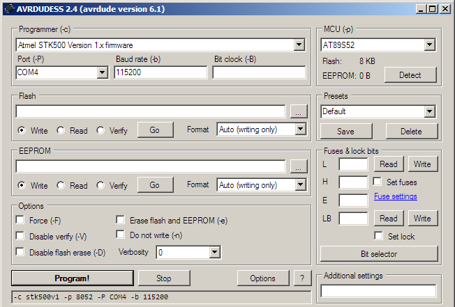
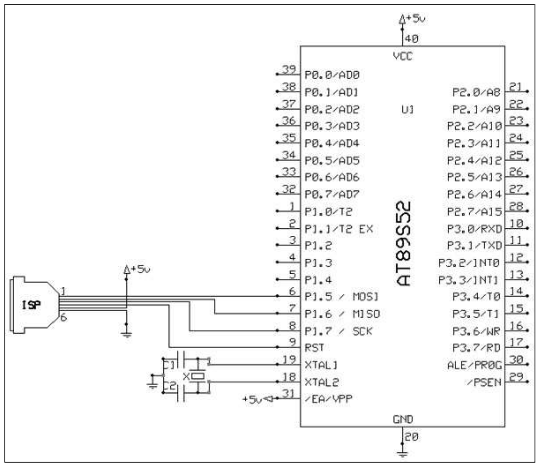

Прошивка AT89S52 с помощью AVRDUDE
==================================

Для тех случаев, когда у вас нет под рукой подходящего
программатора для AT89S52, или когда текущий программатор
по какой-то причине не работает - можно использовать
Arduino (например, Arduino Nano) в паре с AVRDUDE и
GUI к нему AVRDUDESS.

1. Превращаем Arduino в программатор
^^^^^^^^^^^^^^^^^^^^^^^^^^^^^^^^^^^^

В первую очередь, нам необходимо прошить Arduino Nano
в качестве программатора. Для этого можно использовать
скетч Arduino ISP, который находится в меню "Examples"
Arduino IDE и продублирован тут: https://git.io/fA17x.

В скетче на строке 142-143 лучше заменить скорость
порта UART (baudrate) на значение 115200. Больше скорость -
быстрее прошивка AT89S52. Значение 115200 протестировано
и работает, но, возможно, скорость можно поднять еще выше.

2. Установка утилит
^^^^^^^^^^^^^^^^^^^

Следующий пункт - установка AVRDUDESS. AVRDUDESS является
простой графической оболочкой для AVRDUDE - утилиты, которая
позволяет прошивать МК семейства AVR. Скачать можно тут:
http://blog.zakkemble.net/avrdudess-a-gui-for-avrdude/.

Продолжаем движение. Поскольку AVRDUDE отвечает за прошивку
МК семейства AVR, то AT89S52 не поддерживается "из коробки".
Чтобы добавить эту поддержку, придется немного поправить
конфигурационный файл avrdude.conf. Файл avrdude.conf
находится в той же папке, где был установлен сам AVRDUDE,
список изменений нахожится тут: https://git.io/fA15B.
Посмотреть итоговый файл можно с помощью кнопки "view"
в правом верхнем углу.

3. Настройки AVRDUDESS
^^^^^^^^^^^^^^^^^^^^^^

Когда AVRDUDESS установлен и настройки исправлены, можно
выдохнуть и начать пользоваться утилитой. Почти.

Последнее, что нам нужно сделать - выбрать правильные
настройки в окне AVRDUDESS. В качестве программатора выбираем
"STK500 firmware version 1", скорость (baud rate) - 115200,
микроконтроллер (MCU) - AT89S52, порт (port) - COM4 или
любой другой порт, на который подключена Arduino.

На этом все. Осталось подключить AT89S52 к портам ISP Arduino.

Использованные материалы:
^^^^^^^^^^^^^^^^^^^^^^^^^

- `Programming AT89S52 Using USBasp ISP Programmer <https://www.instructables.com/id/Programming-AT89s52-Using-USBasp-ISP-Programmer/>`_.
- `Arduino as ISP and Arduino Bootloaders <https://www.arduino.cc/en/Tutorial/ArduinoISP>`_.
- `In System Programming (ISP) for ATMEL chips <http://ave.dee.isep.ipp.pt/~jvs/aulas/LABSI/4_AVR/at88prog/Programador89S51.pdf>`_.