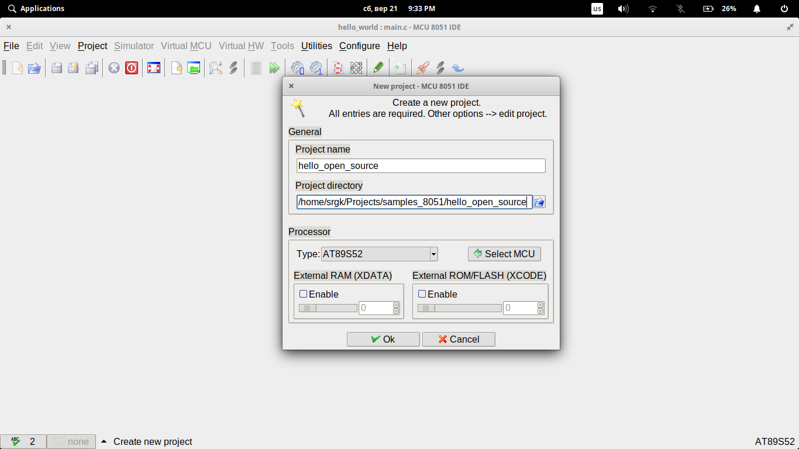

Работаем с AT89S52 под Linux
============================

Один из рекомендованных спобосов для работы с микроконтролерами
семейства С51 - это написание прошивки в среде Keil C51 и
прошивка с помощью нормальных програматоров.

В статье :doc:`./at89s52_avrdude` мы уже сделали небольшое
отступление в сторону и начали прошивать микроконтролер
AT89S52 с помощью avrdude и Arduino.

К сожалению, Keil C51 доступна только под Windows. Поэтому
мы сделаем еще один шаг и начнем писать прошивки под Linux,
с использованием только открытого ПО.

1. Подготовка оборудования
^^^^^^^^^^^^^^^^^^^^^^^^^^

В рамках этой инструкции подразумевается, что для прошивки
используется способ, описанный в :doc:`./at89s52_avrdude`.
Ниже описывается процесс установки утилиты avrdudess и IDE
"MCU 8051 IDE" под Ubuntu, Elementary OS и подобные системы.

2. Установка утилит
^^^^^^^^^^^^^^^^^^^

Первый пункт - установка утилит для прошивки МК. Точно так же, как и на Windows,
для прошивки МК нам поможет avrdude и графический интерфейс avrdudess.

1. Установите avrdude и другие завивимости вручную.

   Полный список зависимостей указан на странице загрузки
   avrdudess. Коротко это: avrdude, утилита для прошивки, и mono, реализация 
   .NET Framework под Linux.

   Чтобы не тратить время, этот список приведен ниже::

    sudo apt install libmono-system-windows-forms4.0-cil avrdude gcc-avr

2. Загрузите свежую версию avrdudess

   Свежую версию утилиты можно найти по ссылке https://blog.zakkemble.net/avrdudess-a-gui-for-avrdude/.

   Для Linux загрузите ZIP-архив с программой. Распакуйте архив в любую папку, которая вам нравится.

.. note::
   В этой инструкции подразумевается, что avrdudess будет находится в папке
   ``/home/srgk/.local_apps/avrdudess``. Замените этот путь на тот, который используется
   в вашей системе.

3. Запустите avrdudess

   Для запуска avrdudess используется mono::

    mono /home/srgk/.local_apps/avrdudess/avrdudess.exe

   Для простоты использования эту консольную команду можно заменить на desktop файл.
   Но это уже тема для другого разговора.

   В любом случае, перед вами должен появиться интерфейс avrdudess.

   .. image:: ./_static/ardudess_linux.png

4. Изменение конфигурации avrdude

   В директории ``/home/srgk/.local_apps/avrdudess`` измените файл ``avrdude.conf``.

   В этот файл нужно добавить секции, которые отвечают за поддержку микрокнтроллеров
   AT89S52 и AT89S51. Тут все аналогично с версией для Windows: просто откройте
   список изменений по адресу https://git.io/fA15B и сделайте аналогичные изменения
   для вашего файла конфигурации.

5. Изменение настроек avrdudess

   Нажмите кнопку "Options" и перейдите в настройки avrdudess.

   .. image:: ./_static/ardudess_options.png

   В поле "File locations" -> "avrdude.conf" укажите путь к папке с новым файлом ``avrdude.conf``::

    /home/srgk/.local_apps/avrdudess

   На этом базовая настройка avrdudess закончена. Дальше следуйте по инструкции :doc:`./at89s52_avrdude`,
   секция "Настройки AVRDUDESS".

3. Установка IDE
^^^^^^^^^^^^^^^^

Теперь перейдем к установке IDE для разработки под AT89S52.

Выбор у нас не большой. Один из основных вариантов - это довольно старая
открытая среда "MCU 8051 IDE" в паре с компилятором "ssdc". Именно эти
компоненты мы и установим::

    sudo apt install ssdc mcu8051ide

На этом установка заканчивается. Можно создавать собственные проекты или
открыть готовый. Например этот: https://git.io/Jesku.

