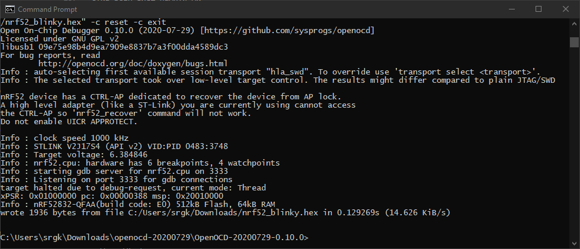

Как прошить nRF52 через ST-Link V2
==================================

Создавать, прошивать и отлаживать прошивки под nRF52 проще всего в Segger Embedded Studio.
Этой мощной средой разработки можно пользоваться `бесплатно <https://www.nordicsemi.com/Software-and-tools/Development-Tools/Segger-Embedded-Studio>`_
для всех продуктов Nordic, она доступна на все основные ОС и ей сравнительно удобно пользоваться.

Есть только один существенный минус: Segger Embedded Studio работает только с Segger J-Link.
Программаторы Segger J-Link хорошие, но, как и любой профессиональный инструмент,
стоят `дорого <https://shop.segger.com/J_Link_p/8.08.00.htm>`_.

К счастью, для прошивки nRF52 есть другая, более дешевая альтернатива: ST-Link V2 и его клоны.
Но, чтобы заставить ST-Link работать с nRF52, придется немного повозиться.

1. Установка драйвера ST-Link
^^^^^^^^^^^^^^^^^^^^^^^^^^^^^

1.1. Установка под GNU/Linux
~~~~~~~~~~~~~~~~~~~~~~~~~~~~

Под GNU/Linux единственное, что нужно сделать - добавить новое правило udev для ST-Link.

Создайте файл ``/etc/udev/rules.d/99-openocd.rules`` со следующим содержимым::

 #STLink V2
 ATTRS{idVendor}=="0483", ATTRS{idProduct}=="374b", MODE="664", GROUP="plugdev"

Перезагрузите правила udev::

 sudo udevadm control --reload-rules && sudo udevadm trigger

И убедитесь, что вы находитесь в группе plugdev::

 usermod -a -G plugdev YOUR_USERNAME_HERE

После этого нужно выйти из системы и зайти обратно, чтобы применить изменения
в пользовательских группах

1.2. Установка под Windows
~~~~~~~~~~~~~~~~~~~~~~~~~~

Необходимо скачать и установить официальный драйвер ST-Link V2:
`STSW-LINK009 <https://www.st.com/content/st_com/en/products/development-tools/software-development-tools/stm32-software-development-tools/stm32-utilities/stsw-link009.html>`_.

2. Установка openocd
^^^^^^^^^^^^^^^^^^^^

.. note::
   В этой инструкции используется openocd версии 0.10.0.
   Если для вашей платформы доступны только более старые версии openocd -
   придется собирать openocd из исходников.

2.1. Установка под GNU/Linux
~~~~~~~~~~~~~~~~~~~~~~~~~~~~

Нас интересует openocd версии 0.10 и выше. Если вам повезло - установить openocd
можно из репозиториев, например для Ubuntu достаточно следющей команды::

  sudo apt install openocd

Если вам НЕ повезло - придется собрать openocd из исходников. Например, по этой
инструкции: https://hackaday.io/page/4991.

2.2. Установка под Windows
~~~~~~~~~~~~~~~~~~~~~~~~~~

1. Загрузите самую свежую версию openocd с сайта: https://gnutoolchains.com/arm-eabi/openocd/.

2. Распакуйте папку ``OpenOCD-20200729-0.10.0`` (либо аналогичную) из архива в любую постоянную локацию:
   Диск ``D:``, ``C:\Program Files``, папка в пользовательской директории, не важно.

3. Сохраните полный путь к папке OpenOCD. Например: ``C:\Users\srgk\Downloads\openocd-20200729\OpenOCD-20200729-0.10.0``.

3. Запуск openocd в режиме сервера
^^^^^^^^^^^^^^^^^^^^^^^^^^^^^^^^^^

3.1. Запуск openocd в режиме сервера под GNU/Linux
~~~~~~~~~~~~~~~~~~~~~~~~~~~~~~~~~~~~~~~~~~~~~~~~~~

TODO

3.2. Запуск openocd в режиме сервера под Windows
~~~~~~~~~~~~~~~~~~~~~~~~~~~~~~~~~~~~~~~~~~~~~~~~

1. Подключите ST-Link V2 к плате с nRF52 по SWD.

2. Подключите ST-Link V2 к компьютеру. убедитесь, что система распознала ST-Link в менеджере устройств:

   .. image:: ./_static/st_link_device_manager.png

3. Откройте новое окно командной строки Windows (cmd.exe).

4. Перейдите в директорию установки openocd:

   .. image:: ./_static/windows_openocd_directory.png

5. Для запуска openocd в режиме Telnet и GDB сервера - используйте команду::

     bin\openocd  -s share\openocd -f interface/stlink.cfg -f target/nrf52.cfg

   Тут:

   - ``share\openocd`` - путь к файлам конфигурации openocd, 
   - ``-f interface/stlink.cfg`` - конфигурация интерфейса отладки/прошивки,
   - ``-f target/nrf52.cfg`` - конфигурация целевой платформы.

   openocd должен запуститься в режиме Telnet и GDB сервера, в этом режиме
   openocd принимает команды для прошивки и отладки по Telnet и GDB:

   .. image:: ./_static/windows_openocd_gdb_server.png

   Остановить openocd можно комбинацией клавиш ``<Ctrl>+C``.

6. Установите telnet клиент на вашем компьютере:

   - https://14bytes.ru/kak-vkljuchit-telnet-klient-v-windows-10/
   - https://social.technet.microsoft.com/wiki/contents/articles/38433.windows-10-enabling-telnet-client.aspx

7. Откройте новое окно командной строки Windows (cmd.exe).

8. Подключитесь к openocd серверу по Telnet::

     telnet 127.0.0.1 4444

   Ожидайте приглашения openocd:

   .. image:: ./_static/windows_openocd_prompt.png

9. Скачайте тестовый файл прошивки (.hex файл):
   https://gist.github.com/s-kostyuk/59c51b05ded67b2bd8580b4fd5751909

10. Используйте следующий набор команд для прошивки устройста::

      init   <<< начать новую сессию
      reset init   <<< сбросить МК и перевести в режим отладки
      halt   <<< остановить ядро МК
      nrf5 mass_erase   <<< очистка ВСЕЙ флеш-памяти МК
      flash write_image C:/Users/srgk/Downloads/nrf52_blinky.hex   <<< прошить файл прошивки, используйте ПОЛНЫй путь
      reset   <<< сбор ядра МК, перевод в нормальный режим работы
      exit   <<< выйти из сессии openocd

   Результат успешного выполнения:

   .. image:: ./_static/windows_openocd_telnet_flash_process.png

   После этих всех процедур nRF52 начинает мигать светодиодом на 13-м пине :)

   .. note::
      Если что-то пошло не так - проверьте подключение, замените провода, найдите информацию
      в Интернете или, если ничего не поможет, пишите в чат клуба: https://t.me/crtv_club_chat.

4. Автоматизация процесса прошивки
^^^^^^^^^^^^^^^^^^^^^^^^^^^^^^^^^^

Прошивку устройста можно выполнять не только через Telnet, но и через консольные
команды. Глобально при этом не меняется ничего, кроме параметров командной строки
openocd. Список команд openocd указывается через параметр ``-c``.

Например для Windows набо команд следующий::

  bin\openocd.exe -s share\openocd -f interface/stlink.cfg -f target/nrf52.cfg -c init -c "reset init" -c halt -c "nrf5 mass_erase" -c "flash write_image C:/Users/srgk/Downloads/nrf52_blinky.hex" -c reset -c exit

Либо в более коротком формате::

  bin\openocd.exe -s share\openocd -f interface/stlink.cfg -f target/nrf52.cfg -c "init; reset init; halt; nrf5 mass_erase; flash write_image C:/Users/srgk/Downloads/nrf52_blinky.hex; reset; exit"

Результат тот же, что и в пункте 3 - МК начинает мигать светодиодом на 13-м пине.

5. Прошивка Nordic SoftDevice
^^^^^^^^^^^^^^^^^^^^^^^^^^^^^

Nordic SoftDevice - это бинарный файл, который располагается в начальной области
флеш-памяти nRF52 и полностью отвечает за поддержку стека BLE. Если ваша прошивка
требует Nordic SoftDevice - процедуру прошивки следует немного адаптировать.

1. Найдите полный путь к образу nRF52 SoftDevice, например::

     C:/Users/srgk/Downloads/s132_nrf52_7.0.1_softdevice.hex

2. Прошейте nRF52 SoftDevice::

     bin\openocd.exe -s share\openocd -f interface/stlink.cfg -f target/nrf52.cfg -c "init; reset init; halt; nrf5 mass_erase; flash write_image C:/Users/srgk/Downloads/s132_nrf52_7.0.1_softdevice.hex; reset; exit"

   Прошить SoftDevice достаточно только ОДИН раз, он остается в памяти до очередного выполнения команды ``nrf5 mass_erase``.
   Точно таким же образом можно обновлять и изменять версии SoftDevice.

3. Прошейте вашу прошивку БЕЗ указания команды ``nrf5 mass_erase``::

     bin\openocd.exe -s share\openocd -f interface/stlink.cfg -f target/nrf52.cfg -c "init; reset init; halt; flash write_image C:/Users/srgk/Downloads/1000.hex; reset; exit"

   Таким образом nRF52 SoftDevice остается нетронутым, меняется только область памяти с вашей прошивкой.

   Если на этом этапе вы выполните ``nrf5 mass_erase``, либо прошьете прошивку без поддержки SoftDevice, то SoftDevice придется прошивать заново.

4. Когда SoftDevice отсутсвует на девайсе, сломан, либо имеет неправильную версию - команды прошивки вашего кода и SoftDevice можно объединить в одну::

     bin\openocd.exe -s share\openocd -f interface/stlink.cfg -f target/nrf52.cfg -c "init; reset init; halt; nrf5 mass_erase; flash write_image C:/Users/srgk/Downloads/s132_nrf52_7.0.1_softdevice.hex; flash write_image C:/Users/srgk/Downloads/500.hex; reset; exit"

Файлы, упомянутые в этом пункте:

- Noridc SoftDevice S132 v7.0.1: https://www.nordicsemi.com/Software-and-tools/Software/S132/Download#infotabs
- прошивка, которая собрана БЕЗ поддержки SoftDevice: https://gist.github.com/s-kostyuk/59c51b05ded67b2bd8580b4fd5751909
- прошивки, которая собраны С ПОДДЕРЖКОЙ SoftDevice: https://gist.github.com/s-kostyuk/c8cf277bf3a220986d10631e797cf140

Больше информации про структуру флеш-памяти в nRF52:

- Про адрес начала пользовательской прошивки: https://infocenter.nordicsemi.com/topic/sds_s132/SDS/s1xx/mem_usage/mem_resource_reqs.html
- Про значение констант ``APP_CODE_BASE`` и ``APP_RAM_BASE``: https://infocenter.nordicsemi.com/topic/sds_s132/SDS/s1xx/mem_usage/mem_resource_map_usage.html
- Про то, как различные версии SoftDevice имеют различные требования по memory layout: https://devzone.nordicsemi.com/nordic/short-range-guides/b/getting-started/posts/adjustment-of-ram-and-flash-memory
- Информация про загрузчик и возможности обновлять SoftDevice "на лету": https://infocenter.nordicsemi.com/topic/sds_s132/SDS/s1xx/mbr_bootloader/bootloader.html
